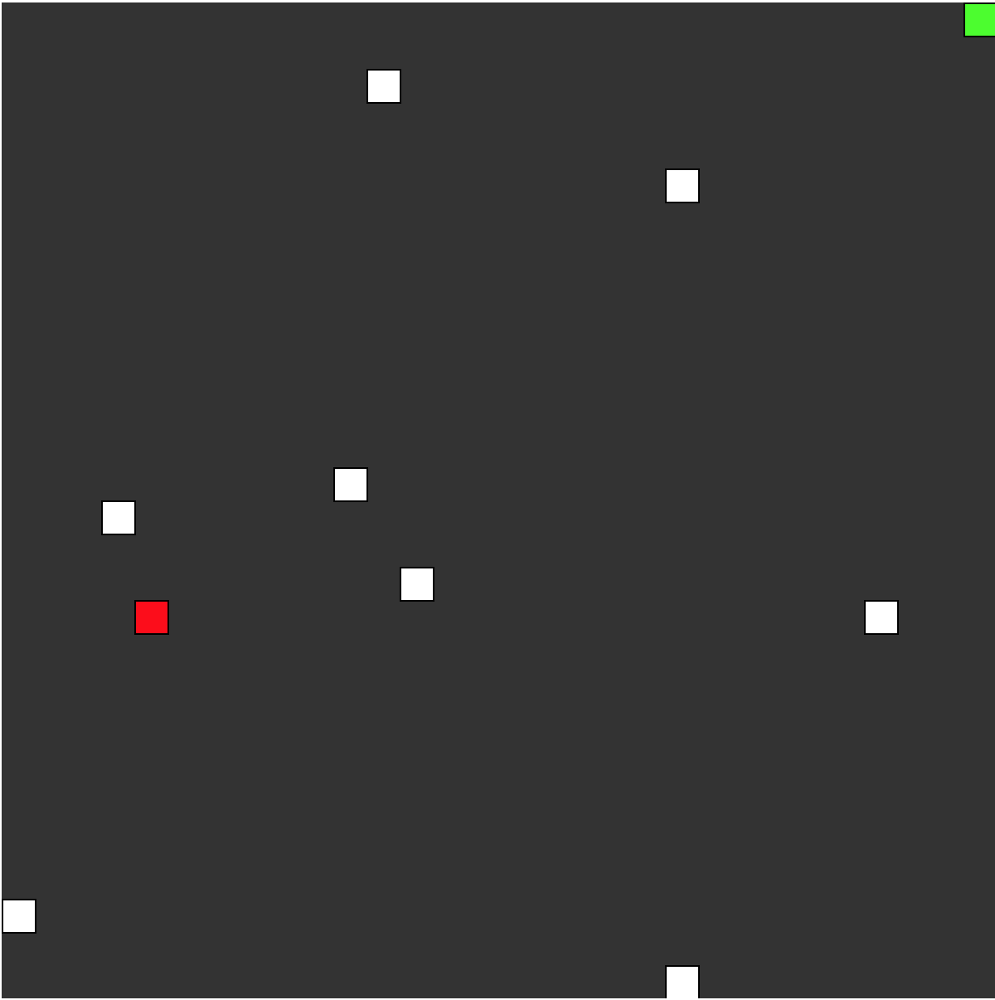

# Veggie Man

## Story
Veggie Man is lives in a dark world. No matter what choices he makes his world becomes more polluted and is slowly dying. He tries his best to only eat Vegetables because meat is detrimental to his health and leaves a Carbon footprint. He soon discovers that even if he eats only Vegetables he still leaves a carbon footprint.

The moral of the story is that the Veggie Mans  world can only survive for a limited amount of time unless the rules are changed. Veggie Man has no power to change this as he constrained by the structure of his world.

## How to play
- You will move around using UP, DOWN, LEFT, RIGHT keys on the keyboard.

- When you eat red meat you leave a carbon footprint. (White square)

- When you eat green veg you also leave a carbon footprint. (No matter how hard he tries to make his world better his efforts seem futile.)

- You need to avoid colliding into the carbon footprints or else you will be reborn again with 0 score.

- You will also need to avoid crashing into the sides or else you will be reborn again with 0 score.

- When you eat you leave a carbon footprint and this makes it harder to get around the board.

## Gameplay

## Why I built Veggie Man
I built this game for my brothers Birthday as I had not got him a present yet and I had a goal to build my first game. He is also Vegan so that inspired the theme.
